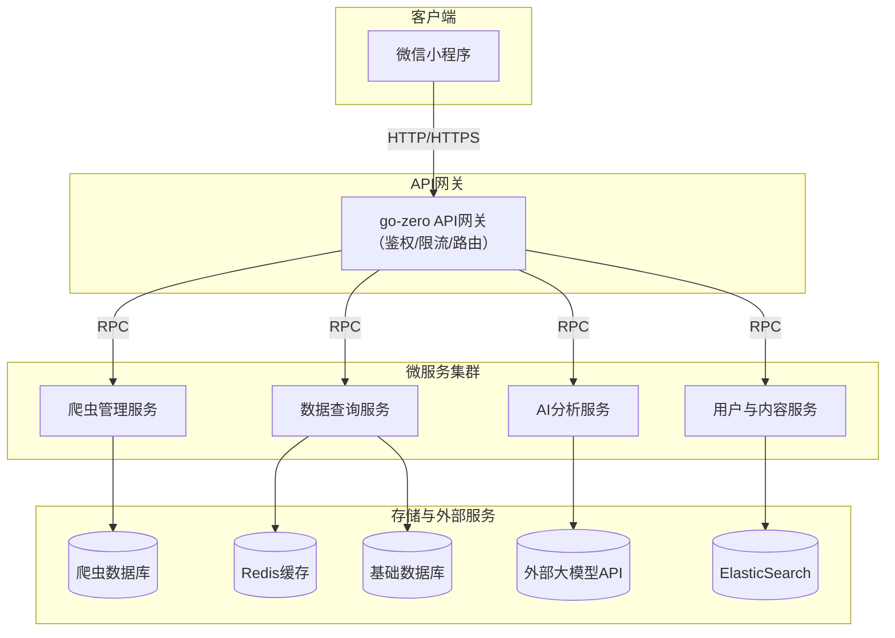

# 灯塔志愿 - 高考志愿填报辅助系统

[](https://golang.org)
[](https://go-zero.dev)
[](https://www.mysql.com)
[](https://redis.io)
[](https://www.elastic.co)

## 项目简介

"灯塔志愿"是一款基于人工智能的高考志愿填报辅助小程序，致力于为考生提供公平、透明、个性化的志愿填报指导。通过整合官方数据和AI智能分析，帮助考生在信息迷雾中找到最适合自己的发展方向。

### 核心特色

- 🎯 **信息公平**: 所有核心功能永久免费，确保信息对所有考生公平触达
- 🤖 **AI智能**: 集成多款大语言模型，提供个性化的志愿推荐和咨询服务
- 📊 **数据透明**: 基于官方录取数据，实时更新，确保数据的权威性和准确性
- 👥 **真实分享**: 建立"灯塔学长"分享平台，让过来人的真实经历为后来人指引方向

## 产品功能

### 1. 智能决策基础模块（免费）
- **数据查询**: 提供官方权威的历年录取分数、位次查询
- **智能推荐**: 输入分数和选科，AI自动生成"冲稳保"志愿方案
- **政策咨询**: AI解答高考志愿相关政策问题

### 2. 深度信息模块
- **专业报告**: 就业数据分析、薪资预测、前景评估
- **学长分享**: 在校生和毕业生分享真实学习生活体验
- **职业测评**: 科学的职业兴趣和性格测试

### 3. 辅助规划工具
- **选科规划**: 基于专业要求的选科建议
- **生涯规划**: 长期职业发展路径规划

## 技术架构

### 整体架构



### 技术栈

- **后端语言**: Go 1.22.7
- **微服务框架**: go-zero
- **数据库**: MySQL 8.0 (主库) + Redis 7.0 (缓存)
- **搜索引擎**: Elasticsearch 8.11
- **消息队列**: Kafka
- **容器化**: Docker + Kubernetes
- **AI服务**: 通义千问、文心一言、GPT-4

### 微信小程序云开发架构（当前实现）

本项目采用**微信小程序云开发**架构，基于官方云开发能力实现：

#### 核心能力

1. **云数据库** (`miniprogram/cloud-functions/`)
   - JSON数据库，灵活的数据结构
   - 自动索引优化
   - 小程序端和云函数端双重权限控制

2. **云函数** 
   - Node.js 运行时环境
   - 无需管理服务器
   - 自动扩缩容

3. **云存储**
   - 文件上传下载
   - 权限管理
   - CDN加速

4. **AI能力集成**
   - 通义千问（阿里云）
   - 文心一言（百度）
   - 智能模型选择

#### 云函数列表

- `generateVolunteerSuggestion`: AI志愿推荐分析
- `getAdmissionScores`: 录取分数线查询
- `saveUserProfile`: 用户档案管理
- `getUserProfile`: 获取用户档案
- `getCollegeInfo`: 学校信息查询
- `initDatabase`: 数据库初始化

#### 相关文档

- [云开发部署指南](CLOUD_DEPLOY_GUIDE.md) - 完整的部署步骤
- [技术方案详解](TECHNICAL_SOLUTION.md) - 详细的技术架构
- [最佳实践指南](miniprogram/cloud-functions/BEST_PRACTICES.md) - 基于官方文档的最佳实践
- [快速参考](miniprogram/CLOUD_QUICK_REFERENCE.md) - API速查表

### Go微服务架构（可选扩展）

如需更高性能或更复杂的业务逻辑，可使用以下Go微服务架构：

1. **API网关服务** (`app/api/`)
   - RESTful API接口
   - JWT认证和权限控制
   - 请求限流和熔断

2. **爬虫管理服务** (`app/spider/rpc/`)
   - 分布式高考数据爬取
   - 基于Asynq的任务调度
   - 反爬虫策略和容错机制

3. **数据查询服务** (`app/score/rpc/`)
   - 高性能数据查询
   - 多级缓存策略
   - 复杂查询优化

4. **AI分析服务** (`app/ai/rpc/`)
   - 多模型AI集成
   - Prompt工程优化
   - 智能志愿推荐算法

5. **用户与内容服务** (`app/user/rpc/`)
   - 用户管理和认证
   - UGC内容管理
   - 搜索引擎集成

## 快速开始

### 环境要求

- Go 1.22.7+
- MySQL 8.0+
- Redis 7.0+
- Elasticsearch 8.11+
- Docker & Docker Compose

### 本地开发

1. **克隆项目**
```bash
git clone https://github.com/your-org/lighthouse-volunteer.git
cd lighthouse-volunteer
```

2. **启动基础设施**
```bash
docker-compose up -d mysql redis elasticsearch
```

3. **运行数据库迁移**
```bash
make migrate-up
```

4. **启动服务**
```bash
# 启动所有服务
make dev

# 或者分别启动
make prod_api
make prod_spider
make prod_score
make prod_ai
make prod_user
```

5. **验证服务**
```bash
curl http://localhost:8888/health
```

### Docker部署

```bash
# 构建并启动所有服务
docker-compose up -d

# 查看服务状态
docker-compose ps

# 查看日志
docker-compose logs -f api
```

### Kubernetes部署

```bash
# 创建命名空间
kubectl create namespace lighthouse

# 创建ConfigMap和Secret
kubectl apply -f deploy/kubernetes/configmap.yaml
kubectl apply -f deploy/kubernetes/secret.yaml

# 部署服务
kubectl apply -f deploy/kubernetes/

# 查看服务状态
kubectl get pods -n lighthouse
```

## 项目结构

```
lighthouse-volunteer/
├── app/                          # 应用服务
│   ├── api/                      # REST API服务
│   ├── spider/rpc/               # 爬虫RPC服务
│   ├── score/rpc/                # 数据查询RPC服务
│   ├── ai/rpc/                   # AI分析RPC服务
│   ├── user/rpc/                 # 用户RPC服务
│   ├── model/                    # 数据模型
│   └── command/                  # 命令行工具
├── common/                       # 通用工具
│   ├── ctxdata/                  # 上下文数据
│   ├── function/                 # 通用函数
│   └── response/                 # 响应处理
├── constant/                     # 常量定义
├── database/migrations/          # 数据库迁移
├── third/                        # 第三方服务集成
├── deploy/                       # 部署配置
│   └── kubernetes/               # K8s配置
├── pb/                           # Protocol Buffer生成文件
└── rules/                        # Cursor规则
```

## 开发指南

### 代码规范

项目遵循go-zero的最佳实践和Tank Rules开发规范：

- 使用goctl自动生成代码
- 遵循分层架构：Handler → Logic → RPC
- 统一的错误处理和日志记录
- 完善的单元测试覆盖

### 开发命令

```bash
# 生成代码
make gen

# 构建服务
make prod

# 运行测试
make test

# 代码检查
make vet
```

### API文档

启动服务后，可访问以下端点查看API文档：

- Swagger UI: `http://localhost:8888/swagger/`
- API列表: `http://localhost:8888/routes`

## 业务流程

### 志愿填报流程

1. **用户注册**: 微信授权登录，完善基本信息
2. **信息录入**: 填写高考分数、位次、选科等信息
3. **智能推荐**: AI基于用户数据生成志愿方案
4. **深度咨询**: 与AI对话获取专业解答
5. **学长分享**: 浏览真实用户分享，获取参考
6. **最终决策**: 综合多方信息做出志愿选择

### 数据更新流程

1. **定时爬取**: 爬虫服务定期从官方渠道获取最新数据
2. **数据清洗**: 解析和标准化录取数据
3. **索引更新**: 更新Elasticsearch搜索索引
4. **缓存刷新**: 更新Redis缓存数据

## 安全与隐私

- **数据加密**: 敏感数据采用AES加密存储
- **访问控制**: JWT令牌认证 + 角色权限控制
- **隐私保护**: 严格遵守数据保护法规，不出售用户数据
- **安全审计**: 完整的操作日志和审计记录

## 监控与运维

### 监控指标

- 服务健康检查和响应时间
- 数据库连接池和查询性能
- Redis缓存命中率
- AI API调用成功率和耗时
- 用户行为分析和业务指标

### 日志管理

- 结构化JSON日志输出
- 分布式链路追踪
- 错误告警和异常检测
- 日志聚合和分析

## 贡献指南

1. Fork项目到个人仓库
2. 创建功能分支: `git checkout -b feature/your-feature`
3. 提交代码: `git commit -m "feat: add your feature"`
4. 推送分支: `git push origin feature/your-feature`
5. 创建Pull Request

### 提交规范

```
<type>(<scope>): <subject>

type: feat, fix, docs, style, refactor, test, chore
scope: api, spider, score, ai, user, common, etc.
```

## 许可证

本项目采用MIT许可证 - 查看 [LICENSE](LICENSE) 文件了解详情。

## 联系我们

- 项目主页: https://github.com/your-org/lighthouse-volunteer
- 问题反馈: https://github.com/your-org/lighthouse-volunteer/issues
- 邮箱: contact@lighthouse-volunteer.com

## 致谢

感谢所有为高考志愿填报事业做出贡献的老师、学生和开发者。愿"灯塔志愿"能照亮每一位考生的前路，助力他们找到最适合自己的发展方向！

⭐ 如果这个项目对你有帮助，请给我们一个star！

